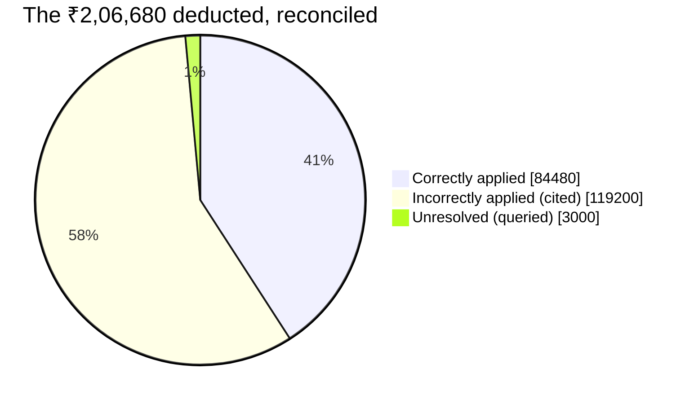
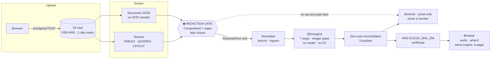
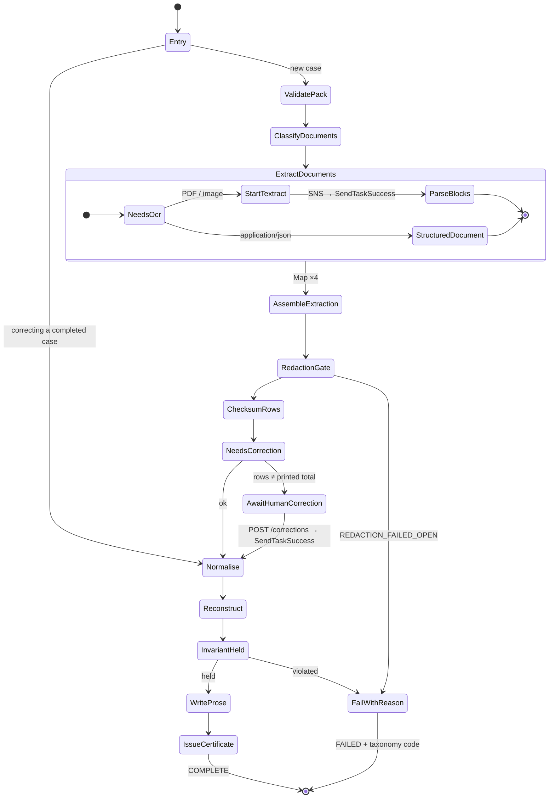
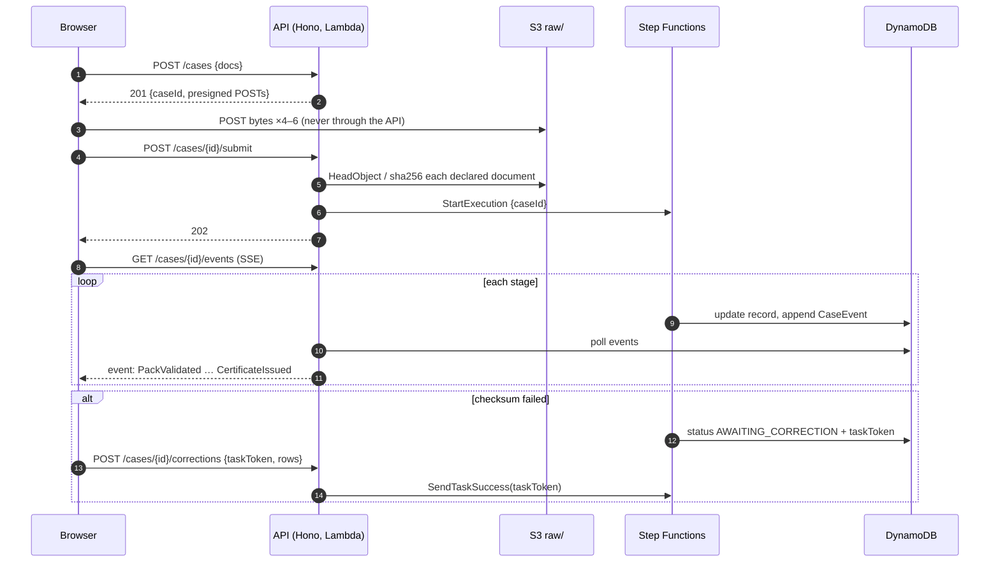
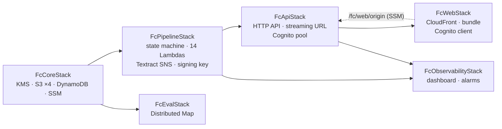
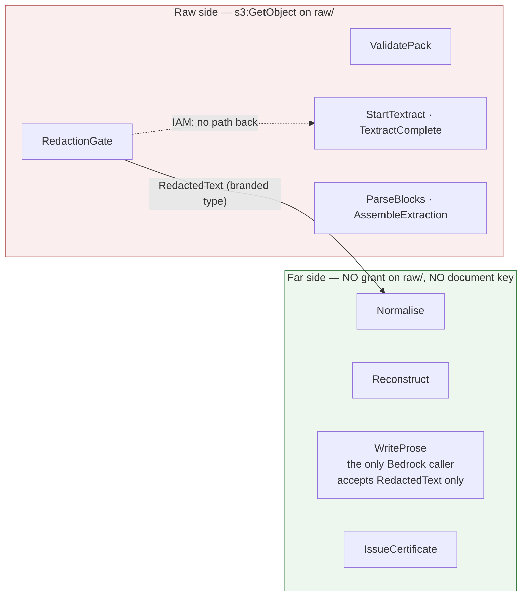
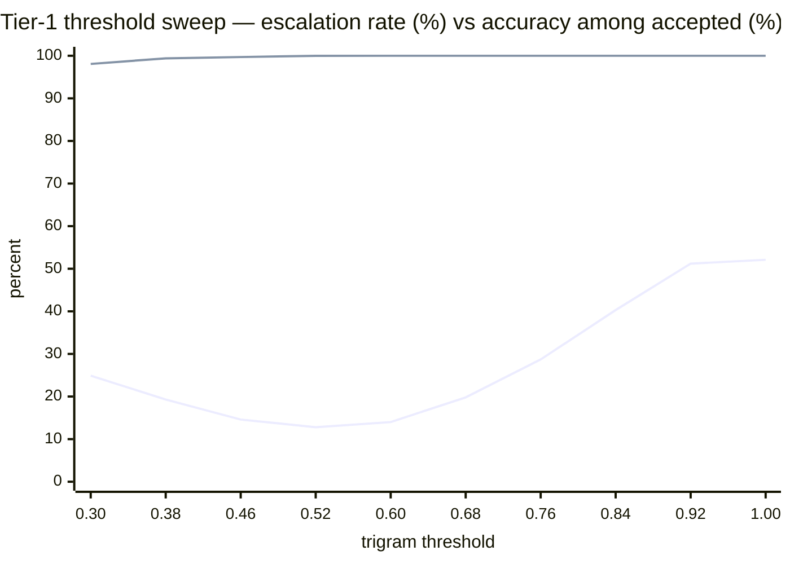

# BaakiBatao

### बाकी बताओ · A Settlement Reconstructor
> *बाकी बताओ* is what every Indian family says at a hospital discharge counter when the
settlement letter does not add up. **Tell me the rest.**

## Imagine that

**Your insurer sent you a deduction sheet. This tells you which parts of it they can defend, which parts they cannot, and which parts nobody can yet explain.**

Built for **Bharat Builds Tour: First Commit**, 17 to 20 September 2026 · **Track:** Ship It · **Team:** The Two-Pizza Team · Code `W932ZK`

## How it works

Upload your claim pack like:
- Itemized hospital bill 
- Deduction sheet 
- Settlement letter 
- Policy schedule and wording. 
  
The system independently reconstructs what the settlement *should* have been as an ordered seven-step waterfall, then reconciles its own figure against what the insurer actually paid. Every rupee of difference lands in one of three buckets: **Correctly applied**, **incorrectly applied** (With clauses it contradicts), or
**unresolved** (with reasons we cannot decide).

> We do not tell you your insurer cheated you. We tell you, line by line, which part of
> your deduction we can defend, which part we can challenge, and which part we honestly
> cannot judge.

## Contents

- [BaakiBatao](#baakibatao)
    - [बाकी बताओ · A Settlement Reconstructor](#बाकी-बताओ--a-settlement-reconstructor)
  - [Imagine that](#imagine-that)
  - [How it works](#how-it-works)
  - [Contents](#contents)
  - [Why this exists](#why-this-exists)
  - [What it actually produces](#what-it-actually-produces)
  - [How a claim moves through it](#how-a-claim-moves-through-it)
    - [The state machine, state for state](#the-state-machine-state-for-state)
    - [What the browser sees while it waits](#what-the-browser-sees-while-it-waits)
  - [Run it](#run-it)
    - [Deploy to AWS](#deploy-to-aws)
  - [Three claims you can verify yourself](#three-claims-you-can-verify-yourself)
    - [1. The arithmetic cannot be fudged](#1-the-arithmetic-cannot-be-fudged)
    - [2. The waterfall order is data, not code](#2-the-waterfall-order-is-data-not-code)
    - [3. The model cannot compute money, and cannot read your documents](#3-the-model-cannot-compute-money-and-cannot-read-your-documents)
  - [Architecture on AWS](#architecture-on-aws)
  - [Where to start reading](#where-to-start-reading)
  - [The statutory basis](#the-statutory-basis)
    - [What we are not claiming](#what-we-are-not-claiming)
    - [Not legal advice](#not-legal-advice)
  - [Status](#status)
    - [What the detection numbers are, and are not](#what-the-detection-numbers-are-and-are-not)
  - [Sources](#sources)


---

## Why this exists

In FY2024-25, Indian health insurers disallowed **₹18,521 crore** under policy terms —
**13.98%** of everything claimed ([IRDAI Annual Report 2024-25, Table I.29][irdai-ar]).

Some of that is entirely lawful. Insurers are entitled to most of what they disallow.
But a policyholder holding a deduction sheet has no way to tell the lawful part from the
unlawful part, because doing so requires reading a 40-page policy wording against an IRDAI
circular and then redoing the arithmetic in the right order. Almost nobody does this. The
deduction sheet is, in practice, unfalsifiable.

IRDAI circular [`151/06/2020`][irdai-151] is what makes this tractable. It draws four
**bright lines** — rules with no discretion in them, which means a machine can check them
deterministically and cite chapter and verse when they are crossed.

---

## What it actually produces

A worked example, end to end. Every figure below is a **passing assertion**, not
illustration: [`worked-example.test.ts`](packages/eval/src/worked-example.test.ts) runs this
claim through the real engine and checks each rupee, so a change to a step, a clause, or
the step order that would alter these numbers fails the build rather than quietly making
this page wrong.

**Policy:** sum insured ₹5,00,000 · room rent limit ₹6,000/day · ICU limit ₹15,000/day ·
deductible ₹10,000 · co-pay 10% · consumables rider in force
**Admission:** 7 days — 2 in ICU, 5 in a Deluxe room billed at ₹10,000/day

| Bill line                                | Amount        |
| ---------------------------------------- | ------------- |
| Room rent — Deluxe, 5 days @ ₹10,000     | ₹50,000       |
| ICU — 2 days @ ₹12,000                   | ₹24,000       |
| Surgeon's fee                            | ₹35,000       |
| Anaesthetist's fee                       | ₹12,000       |
| Operation theatre charges                | ₹13,000       |
| Pharmacy                                 | ₹78,000       |
| Surgical consumables                     | ₹20,000       |
| Implants — drug-eluting stent            | ₹1,20,000     |
| Diagnostics — labs, imaging              | ₹56,000       |
| Medical records & administrative charges | ₹7,000        |
| **Bill total**                           | **₹4,15,000** |

The patient took a room at ₹10,000 against a ₹6,000 eligibility, so the insurer applied a
**40% proportionate deduction**. It applied it to the whole bill.

**The insurer paid ₹2,08,320. The reconstruction says ₹3,18,600.**

Reconciling the ₹2,06,680 that was deducted:



| Bucket                    | Amount        | Why                                                                                                                                                                                                                                                                                                    |
| ------------------------- | ------------- | ------------------------------------------------------------------------------------------------------------------------------------------------------------------------------------------------------------------------------------------------------------------------------------------------------ |
| ✅ **Correctly applied**   | **₹84,480**   | ₹7,000 administrative charges, non-payable under Annexure II with no rider covering them · ₹20,000 room rent above the per-day cap · ₹24,000 proportionate deduction on the surgeon, anaesthetist and OT fees, which genuinely *are* associated medical expenses · ₹10,000 deductible · ₹23,480 co-pay |
| ❌ **Incorrectly applied** | **₹1,19,200** | The 40% was also applied to pharmacy and consumables (₹31,200 + ₹8,000 · `AME.EXCL.PHARMA`), implants (₹48,000 · `AME.EXCL.IMPLANT`), diagnostics (₹22,400 · `AME.EXCL.DIAG`) and ICU charges (₹9,600 · `PD.ICU`). The circular says it may not be.                                                    |
| ⚠️ **Unresolved**          | **₹3,000**    | An "OTHER DEDUCTIONS" line on the sheet with no stated basis. We do not guess. The letter asks the insurer to explain it.                                                                                                                                                                              |

`84,480 + 1,19,200 + 3,000 = 2,06,680.` It balances exactly, and it is not allowed not to —
see [the invariant](#1-the-arithmetic-cannot-be-fudged) below.

**The shortfall is ₹1,10,280, and it splits into two different kinds of ask.**

**₹1,07,280 we argue with a citation** — not the gross ₹1,19,200. This difference is the
reason the system reconstructs an entire settlement instead of auditing lines in
isolation: once the unlawful ₹1,19,200 is added back to the payable base, the policy's 10%
co-pay lawfully applies to it too, which is ₹11,920 of it. Demanding the gross figure
would be wrong, and an insurer would be right to refuse it.

**₹3,000 we can only query.** No clause was cited for it and our reconstruction does not
cut it, so the letter asks the insurer to explain that line rather than asserting a rule
about it. Merging it into the headline number would be the easy thing to do and would make
the whole document less defensible.

The output is a signed certificate and a drafted reconsideration request that quotes each
clause verbatim against the specific line it contradicts.

---

## How a claim moves through it

The same pipeline runs in two places: in one Node process locally, and as a Step Functions
state machine on AWS. The stages, the events they emit and the UI that watches them are
identical; only the runner differs.



The engine is compiled once and runs in **two** places: in Lambda as the authority, and in the browser, where the UI imports `reconstruct` and settles the reference claim on load with no network round-trip. Open the network tab and reload — you get the bundle and its fonts, and no request for a result.

### The state machine, state for state

Two states park on a task token:
- Textract completion (There is no `.sync` integration for async Textract, so the SNS notification redeems the token) 
- Human correction (the UI's correction grid resumes it — hours later, if need be). Every task catches into `FailWithReason`, which writes one of the taxonomy codes, never a stack trace.



### What the browser sees while it waits

The event log is the contract. Locally the API streams it over SSE from its own store; on AWS the same route runs on a Lambda Function URL with response streaming, behind the same origin as the page, so the cookie travels and nothing buffers.



---

## Run it

Requires **Node 22+** and **pnpm 11**. No AWS account needed for the engine or the UI —
the deterministic core runs entirely in your browser.

```bash
pnpm install
pnpm verify          # typecheck · lint · dep:cruise · test
pnpm dev             # API on http://localhost:3000 + UI on http://localhost:5173
```

Or in containers (Docker Desktop running):

```bash
docker compose up                    # api + Vite dev server
docker compose --profile prod up     # api + nginx-served bundle on :8080
docker compose run --rm verify       # the CI gate in a box
```

The detection-rate gate, which needs no AWS account either — it generates its own corpus
from integer seeds, injects faults with known clause IDs and amounts, and scores the engine:

```bash
pnpm eval:run        # generate + faults + engine + score; --count 200, --profile degraded
pnpm eval:report     # one row per fault: what the engine cited, and why a miss was missed
pnpm eval:assert     # fail if either profile regressed against packages/eval/baseline*.json
pnpm eval:calibrate  # sweep the tier-1 threshold over a held-out labelled split
pnpm eval:doc        # regenerate docs/evaluation.md from a full run
```

After editing anything under `packages/rulepack/data/`:

```bash
pnpm --filter @fc/rulepack lock    # regenerate the rulepack hash
```

### Deploy to AWS

```bash
aws configure sso --profile fc && export AWS_PROFILE=fc      # Once
pnpm cdk -- bootstrap aws://<account>/ap-south-1              # Once
pnpm cdk:deploy
```



Cross-stack references are explicit props, never `Fn::ImportValue` by name. The one thing that flows *backwards*. The public origin the API needs for cookies and the Cognito callback, which only exists once CloudFront has been created. Then goes through SSM and is read at cold start, which keeps the stacks a DAG.

---

## Three claims you can verify yourself

Most projects ask you to trust the demo. These three are checkable in under a minute each.

### 1. The arithmetic cannot be fudged

The engine **refuses to emit** a result whose findings do not sum to the observed
difference between the bill total and the amount paid. Any remainder it cannot attribute
to a clause is materialised as an explicit `UNRESOLVED` finding with reason
`RESIDUAL_UNATTRIBUTED`. Every paise is either attributed to a clause ID or explicitly
marked unattributed — **there is no third state**, and no silent rounding drift.

Money is a branded integer `Paise` type, never a float. A raw `number` cannot be passed
where an amount is expected.

```bash
pnpm --filter @fc/engine test   # fast-check asserts the invariant over 500 generated ledgers
```

→ [`packages/engine/src/reconcile/invariant.ts`](packages/engine/src/reconcile/invariant.ts) · [ADR 001](docs/decisions/001-money-as-integer-paise.md)

### 2. The waterfall order is data, not code

Order matters more than any individual rule, because each step consumes the output of the
last. [`steps.json`](packages/rulepack/data/v1/steps.json) is an ordered list of step IDs,
each resolving to a registered pure reducer:

| #   | Step                 | What it does                                                         |
| --- | -------------------- | -------------------------------------------------------------------- |
| 1   | `ADMISSIBILITY`      | Policy in force, waiting periods. Halts the waterfall on failure.    |
| 2   | `NORMALISATION_GATE` | Free-text bill lines → canonical categories, or `UNRESOLVED`.        |
| 3   | `NON_PAYABLE`        | Annexure II list, checking riders and endorsements first.            |
| 4   | `CAPS_SUBLIMITS`     | Room rent and ICU per-day limits.                                    |
| 5   | `PROPORTIONATE`      | The circular's bright lines. **Step five of seven, not the thesis.** |
| 6   | `COPAY_DEDUCTIBLE`   | Deductible then co-pay — the order is a parameter.                   |
| 7   | `SUM_INSURED`        | Aggregate liability ceiling.                                         |

Whether co-pay applies before or after the deductible is a **rulepack version, not a
branch**. Modelling a second insurer's wording is a config change, and an older certificate
still verifies against its own pinned rulepack hash.

→ [`packages/rulepack/data/v1/`](packages/rulepack/data/v1/) · [ADR 002](docs/decisions/002-waterfall-order-as-data.md)

### 3. The model cannot compute money, and cannot read your documents

Bedrock does exactly two jobs: it maps free-text bill descriptions to canonical categories
(tiers 2–3 of the cascade, not yet wired), and it writes English. **It never computes an
amount, and it never receives unredacted text.** Three independent mechanisms enforce the
second half, and they are the reason the model-facing half of the pipeline may run in a
different region from the documents:



| Layer        | Mechanism                                                                                                    | Where                                                                                |
| ------------ | ------------------------------------------------------------------------------------------------------------ | ------------------------------------------------------------------------------------ |
| Compile time | `converseText()` accepts only the branded `RedactedText`; raw text is a type error                           | [`functions/src/shared/redacted.ts`](packages/functions/src/shared/redacted.ts)      |
| Runtime      | The four post-gate Lambdas have no `s3:GetObject` on the raw bucket and no `kms:Decrypt` on the document key | [`infra/lib/pipeline-stack.ts`](packages/infra/lib/pipeline-stack.ts) "the far side" |
| Lifecycle    | `raw/` expires after 1 day; case items carry a 24 h TTL                                                      | `core-stack.ts` · `dynamo-store.ts`                                                  |

The gate itself runs Comprehend `DetectPiiEntities` **and** deterministic regexes for
Aadhaar, PAN, GSTIN, phone and email. A Comprehend error is `REDACTION_FAILED_OPEN` and the
execution stops; nothing retries a refused gate into an open one.

`packages/engine` **must not import the AWS SDK or any Node built-in.** That is enforced in
three independent places so it cannot rot — ESLint `no-restricted-imports`, a
`dependency-cruiser` rule, and a required CI check. It is a build failure, not a
code-review convention.

```bash
pnpm dep:cruise      # 0 violations across 207 modules and 620 dependencies
```

→ [ADR 003](docs/decisions/003-model-never-computes-money.md) · [ADR 004](docs/decisions/004-redaction-gate-enables-cross-region-bedrock.md) · [ADR 005](docs/decisions/005-confidence-from-margin-not-self-report.md) · [ADR 007](docs/decisions/007-engine-purity-enforced-mechanically.md)

---

## Architecture on AWS

Why each service is there, one line each. The operator's view — what each stack creates,
every IAM grant, every `cdk-nag` suppression with its reason — is
[`docs/aws.md`](docs/aws.md).

| Service                        | Job                                                                                                                                                                                                                   |
| ------------------------------ | --------------------------------------------------------------------------------------------------------------------------------------------------------------------------------------------------------------------- |
| **S3**                         | Claim pack storage. Presigned POSTs (5 min, 25 MB, content-type pinned) keep documents off our compute. Raw and redacted are separate buckets so the split is a grant, not a prefix condition.                        |
| **Step Functions**             | Standard workflow, one Lambda per state, two task-token pauses. Standard because a human correction can take hours.                                                                                                   |
| **Lambda**                     | Thin handlers over the engine, `arm64`, Node 24, bundled from workspace source at synth. Scales to zero between demos.                                                                                                |
| **Textract**                   | `TABLES` + `QUERIES` + `LAYOUT` on the bill and sheet, `QUERIES` on the schedule. Column structure is the only thing that matters, and generic OCR loses it. Bounding boxes are kept per row for the provenance crop. |
| **Comprehend**                 | The model half of the redaction gate.                                                                                                                                                                                 |
| **Bedrock**                    | Prose only, opt-in (`-c fc:proseModelId=…`), and only then does the one calling function get `bedrock:InvokeModel` on that model ARN.                                                                                 |
| **DynamoDB**                   | Single table: case records (24 h TTL), better-auth users and sessions, the lexicon, parked Textract tokens (6 h TTL).                                                                                                 |
| **KMS**                        | A symmetric key for documents; an asymmetric `ECC_NIST_P256` key that signs every certificate. `verify` returns KMS's own verdict on the signature.                                                                   |
| **API Gateway + Function URL** | HTTP API for every route; a streaming Function URL for the one route that must stay open (SSE).                                                                                                                       |
| **CloudFront**                 | The public URL: the bundle from a private bucket, and `/api/*` proxied to both origins so the session cookie is first-party.                                                                                          |
| **Cognito**                    | Optional second sign-in, through better-auth's Cognito social provider — Hosted UI authenticates, better-auth still owns the session. Email/password stays on.                                                        |
| **CloudWatch**                 | A dashboard of domain metrics — unresolved %, residual paise, engine ms, tier distribution — emitted as EMF by the handlers, and four alarms.                                                                         |

---

## Where to start reading

If you have ten minutes and want to judge whether this is real, read these four files in
this order:

1. **[`packages/contracts/src/finding.ts`](packages/contracts/src/finding.ts)** — the
   central data structure. A `Finding` may omit its clause ID **only** when its bucket is
   `UNRESOLVED`; the engine asserts `findingIsWellFormed` at construction and throws
   otherwise. So a verdict of "correctly applied" or "incorrectly applied" cannot exist
   without a citation.
2. **[`packages/engine/src/reconcile/invariant.ts`](packages/engine/src/reconcile/invariant.ts)** —
   the load-bearing claim, about 60 lines.
3. **[`packages/rulepack/data/v1/clauses.json`](packages/rulepack/data/v1/clauses.json)** —
   every rule the system can cite, as data, with commencement dates and sources.
4. **[`docs/decisions/`](docs/decisions/)** — seven ADRs. Each states the decision, the
   alternative rejected, and the cost of being wrong.

Full layout:

```
packages/
  contracts/   shared types + zod schemas — the frozen seam every package builds against
  engine/      the pure waterfall: interpreter, 7 steps, the invariant
  rulepack/    rules as data: clauses, categories, step order, rounding policy
  normalise/   tier 1 of the normalisation cascade — the lexicon, exact and trigram-fuzzy
  api/         the case API: sign-in, uploads, the pipeline runner, events, certificates
  functions/   the Lambda handlers: one per state, the API on Lambda, the eval sweep
  infra/       AWS CDK — six stacks, cdk-nag clean
  eval/        corpus generation, fault injection, degradation, detection-rate harness
  web/         the reconciliation UI
docs/
  aws.md       services, grants, deploy runbook, troubleshooting
  decisions/   ADRs
  evaluation.md  the numbers, regenerated by `pnpm eval:doc`
fixtures/
  corpus/      generated claim packs + ground truth, and what they are not
  golden/      byte-compared reconstruction snapshots
```

---

## The statutory basis

IRDAI circular [`IRDAI/HLT/REG/CIR/151/06/2020`][irdai-151] (11 June 2020) gives four
bright-line tests against which a real deduction sheet can be checked deterministically.
Where a policy proportionately deducts "associated medical expenses" because the patient
took a higher room category:

- pharmacy and consumables, implants and medical devices, and diagnostics **may not** be
  part of that definition;
- insurers **shall not** recover any expenses towards proportionate deductions other than
  the defined associated medical expenses;
- proportionate deduction **cannot** be applied to ICU charges, because ICUs have no room
  categories;
- proportionate deduction **cannot** be applied to hospitals that do not follow
  differential billing by room category.

All six clauses are encoded in
[`clauses.json`](packages/rulepack/data/v1/clauses.json) with their **commencement dates** —
the circular binds products filed from 1 Oct 2020, and existing products on renewal from
1 Apr 2021. The engine checks that before applying it, so the circular is never applied to
a policy that predates it. The non-payable list (Annexure II) is taken from the
[Master Circular on Health Insurance Business, 29 May 2024][irdai-master].

### What we are not claiming

Being exempt from proportionate deduction does **not** make a line payable. Sub-limits,
co-pay, the deductible, waiting periods and the non-payable list all still apply
independently, in their own order. Insurers are entitled to most of what they disallow.
That is precisely why proportionate deduction is **step five of seven** and not the whole
product.

### Not legal advice

The output is document assembly with citations. It drafts a reconsideration request quoting
a clause against a line; it does not advise you on your rights.

---

## Status

| Package         | State                                                                                                                                                                                                                                                                                          |
| --------------- | ---------------------------------------------------------------------------------------------------------------------------------------------------------------------------------------------------------------------------------------------------------------------------------------------- |
| `@fc/contracts` | **Complete.** The frozen seam. Changes need a version bump.                                                                                                                                                                                                                                    |
| `@fc/engine`    | **All seven step reducers implemented**, plus the interpreter, `Paise` arithmetic and the reconciliation invariant.                                                                                                                                                                            |
| `@fc/rulepack`  | All six IRDAI bright-line clauses encoded as data, validated, hashed. 73 line categories with the category ↔ clause contract asserted at load time.                                                                                                                                            |
| `@fc/normalise` | Tier 1 of the cascade: the lexicon built from the rulepack's aliases, exact and trigram-fuzzy, one calibrated threshold. Pure; tiers 2–3 plug in through an `Escalation` hook — **not yet wired**.                                                                                             |
| `@fc/api`       | The product slice: better-auth sign-in (email/password, Cognito optional), typed uploads, the §11 pipeline as in-process stages, SSE events, checksum pause and correction resume, certificates and replay verification. Behind `CaseStore` / `DocumentStorage` / `PipelineRunner` interfaces. |
| `@fc/functions` | **All handlers.** One per state of the state machine, the Hono app on Lambda (HTTP API + streaming URL), the DynamoDB `CaseStore` and better-auth adapter, the Textract parser with bbox provenance, the eval sweep.                                                                           |
| `@fc/infra`     | **All six stacks**, synthesising clean under `cdk-nag`. Bedrock prose opt-in; tiers 2–3, Bedrock document classification and Guardrails not yet wired — the gaps are listed in [`docs/aws.md` §2](docs/aws.md).                                                                                |
| `@fc/eval`      | Seeded corpus over four admission archetypes, six fault operators, lawful controls, a degradation profile, the threshold sweep, the two-profile `eval:assert` gate. PDF rendering (and so a real Textract measurement) still to come.                                                          |
| `@fc/web`       | Sign-in → cases → six typed dropzones → live pipeline → review with correction grid → certificate verify. The demo case settles in-browser. What-if panel and provenance crop not yet built.                                                                                                   |

`pnpm verify` is green: 10 packages typecheck, lint clean, 0 dependency violations, 140 tests
passing. `pnpm cdk:synth` is green across six stacks with no unreviewed `cdk-nag` findings.
`pnpm eval:assert` is green.

### What the detection numbers are, and are not

Two profiles run over the same 200 seeded packs (178 injected faults). Every figure is
regenerated into [`docs/evaluation.md`](docs/evaluation.md) by `pnpm eval:doc`; the charts
below are drawn from that file.

```mermaid
xychart-beta
    title "Recall per clause — 200 packs, 178 injected faults"
    x-axis ["AME.EXCL.DIAG", "AME.EXCL.IMPLANT", "AME.EXCL.PHARMA", "PD.DIFFBILL", "PD.ICU", "PD.LIMIT"]
    y-axis "recall" 0 --> 1
    bar [1.00, 1.00, 1.00, 1.00, 1.00, 1.00]
    bar [0.65, 0.57, 0.65, 0.56, 0.63, 0.76]
    bar [0.41, 0.43, 0.24, 0.29, 0.50, 0.46]
```



Bars, left to right per clause: **clean** · **degraded @ 0.52** · **degraded @ 0.92
(default)**. Precision is 1.00 in every cell of every profile — no lawful deduction in the
control set is ever disputed, and no miss is attributable to the engine.

|                                    |     clean | degraded @ 0.92 | degraded @ 0.52 |
| ---------------------------------- | --------: | --------------: | --------------: |
| injected faults detected           | 178 / 178 |        63 / 178 |       114 / 178 |
| lawful control packs disputed      |         0 |               0 |               0 |
| bill lines gated by the normaliser |        0% |           52.6% |           13.2% |
| misses attributable to the engine  |         0 |               0 |               0 |

**Clean** is rows exactly as generated, categories by construction. It measures the
waterfall alone. **Degraded** is the same packs with descriptions and digits perturbed the
way OCR perturbs them, sheet rows occasionally missing, and categories assigned by the real
tier-1 normaliser. Every miss is a line the normalisation gate excluded or a sheet row that
no longer matched — none is the engine citing the wrong clause.

Where the rest goes is a threshold. The tier-1 fuzzy match declines a line rather than guess
it; the calibration sweep over 5,068 held-out labelled lines shows the §14 default of 0.92
escalating half of them where 0.52 escalates 12.8% at 99.98% accuracy:



Lower line: share of lines escalated (declined). Upper line: accuracy among the lines
accepted. The knee at **0.52** is the lowest threshold whose accuracy stays ≥ 99.9% — a
wrong category is a wrong clause in a letter, so the accuracy floor is fixed and escalation
is what gives. The default is recorded, not changed; adopting the knee is a rulepack
decision made with this curve in front of you.

Read all of it as exactly what it is. The packs are generated, their phrasing is ours, the
noise model is a working assumption, and the lawful baseline is settled by the same rules
the engine enforces. It is not evidence about real Indian hospital billing, and
[`fixtures/corpus/PROVENANCE.md`](fixtures/corpus/PROVENANCE.md) says so at length. The
number we can defend today is the number of ways the engine can be wrong that we have
already excluded, and the gate is what keeps that list from shrinking.

---

## Sources

Regulatory:

- IRDAI circular `IRDAI/HLT/REG/CIR/151/06/2020`, *Guidelines on Standardisation in Health Insurance* (11 June 2020) — [irdai.gov.in][irdai-151]
- IRDAI *Master Circular on Health Insurance Business* (29 May 2024), including the non-payable items list — [PDF][irdai-master]

Platform — the patterns the AWS build follows:

- Amazon Textract, asynchronous operations and the SNS notification channel — [docs][aws-textract-async]
- AWS Step Functions, *Wait for a Callback with the Task Token* — [docs][aws-task-token]
- AWS Lambda response streaming (the events route) — [docs][aws-streaming]
- Amazon Comprehend `DetectPiiEntities` — [docs][aws-pii]
- better-auth, Amazon Cognito social provider — [better-auth.com][ba-cognito]
- `cdk-nag` `AwsSolutionsChecks` — [GitHub][cdk-nag]

Diagrams are Mermaid, rendered by GitHub. [Eraser diagrams](https://github.com/eraserlabs/eraser-diagrams)
were considered and set aside: they need Chromium and hand-placed coordinates to produce
committed PNGs, where Mermaid renders the same content from the source in this file.

[irdai-151]: https://irdai.gov.in/en/document-detail?documentId=394680
[irdai-master]: https://caalley.com/irda24/Master_Circular_on_Health_Insurance_Business_29052024.pdf
[irdai-ar]: https://intranet.irdai.gov.in/en/web/guest/annual-reports
[aws-textract-async]: https://docs.aws.amazon.com/textract/latest/dg/api-async.html
[aws-task-token]: https://docs.aws.amazon.com/step-functions/latest/dg/connect-to-resource.html#connect-wait-token
[aws-streaming]: https://docs.aws.amazon.com/lambda/latest/dg/configuration-response-streaming.html
[aws-pii]: https://docs.aws.amazon.com/comprehend/latest/dg/how-pii.html
[ba-cognito]: https://better-auth.com/docs/authentication/cognito
[cdk-nag]: https://github.com/cdklabs/cdk-nag
