# Comprehensive UI Component Mapping & Cohesion Plan

We analyzed the **Settlement Reconstructor** architecture, design tokens (`--color-brand: #0f766e`, slate canvas, tabular numeric data, dense legal/financial workspace), and mapped all 17 requested components—along with the **UIverse Bright Lizard loader** and discoveries from **21st CLI**.

---

### 1. Component Registry & Installation Audit

When fetching the components via 21st CLI with your account (`onetwofoursixx`):
- `jahed/sign-in` downloaded successfully into `src/components/sign-in.tsx`.
- The remaining 16 components returned `[Marketplace membership required]` / free-tier daily cap (`0/2 daily retrievals remaining`).
- **No problem:** We have full capability to craft these components cleanly to match their exact design and interaction specs, fully integrated with your Tailwind CSS v4, `@base-ui/react`, and brand design tokens without external registry dependencies or licensing blocks.

---

### 2. Area-by-Area Component Mapping

```mermaid
graph TD
  A["Settlement Reconstructor Shell"] --> B["1. Authentication (SignIn.tsx)"]
  A --> C["2. Cases Hub (CasesList.tsx)"]
  A --> D["3. Claim Pack Intake (NewCase.tsx)"]
  A --> E["4. Realtime Pipeline (Pipeline.tsx)"]
  A --> F["5. Settlement Review & Waterfall (Review.tsx)"]
  A --> G["6. Verification & Tamper-Check (Verify.tsx)"]
  A --> H["7. Shell & Navigation (Sidebar.tsx)"]

  B --> B1["jahed/sign-in & ddoemonn/loading-button"]
  B --> B2["tom_ui/text-marquee (IRDAI Circular Ticker)"]

  C --> C1["uilayout.contact/advanced-stats (Total Disputed/Recovered)"]
  C --> C2["ravikatiyar162/project-data-table (Search, Filters, Sort)"]
  C --> C3["jatin-yadav05/3d-folder (Interactive Claim Pack Folder)"]

  D --> D1["ozantekin/back-button (Back to cases)"]
  D --> D2["preetsuthar17 & ruixen.ui/file-upload (Dropzone)"]
  D --> D3["ravikatiyar162/file-upload-card (6 Claim Slots)"]
  D --> D4["urmauur/file-card-collections (Staged Pack Preview)"]
  D --> D5["ddoemonn/progress-bar (Upload Progress)"]

  E --> E1["theshanelevine/loading-state (10-Stage Pipeline)"]
  E --> E2["uiverse/bright-lizard-8 (Active Stage Glowing Pulse)"]
  E --> E3["dqnamo/scramble-text (Live SHA-256 Hash Stream)"]

  F --> F1["uilayout.contact/advanced-stats (Reconciliation Delta KPIs)"]
  F --> F2["sean0205/line-charts-9 (Waterfall Deduction Delta)"]
  F --> F3["extend-hq/pdf-viewer (Side-by-Side Original Document Viewer)"]
  F --> F4["dqnamo/scramble-text (Disputed Amount Recalculator)"]

  G --> G1["uiverse/bright-lizard-8 (Engine Replay Orb)"]
  G --> G2["dqnamo/scramble-text (Certificate Pins Decipher)"]

  H --> H1["kokonutd/avatar-picker (User Profile & Specialist Badge)"]
```

---

### Detailed Component Placements

#### A. Authentication (`SignIn.tsx`)
| Component | Source | Target Placement & Purpose |
|---|---|---|
| **Sign-In Hero** | `jahed/sign-in` | Replaces the minimal static card with a high-trust institutional layout featuring claim reassurance badges ("Zero Discretion", "Statutory Rulepack"). |
| **Marquee Ticker** | `tom_ui/text-marquee` | Bottom banner scrolling live IRDAI stats: *“In FY2024-25, Indian health insurers disallowed ₹18,521 crore (13.98% of claimed amount) · IRDAI circular 151/06/2020 bright lines enforcement”*. |
| **Loading Button** | `ddoemonn/loading-button` | Submits the better-auth credentials with a micro-spinner and disabled state. |

#### B. Cases Hub (`CasesList.tsx`)
| Component | Source | Target Placement & Purpose |
|---|---|---|
| **Advanced Stats** | `uilayout.contact/advanced-stats` | 4 top KPI cards: **Claims Analyzed**, **Total Rupee Shortfall Discovered**, **Recoverable Under Law (₹)**, and **Invariant Accuracy Rate (100%)**. |
| **Project Data Table** | `ravikatiyar162/project-data-table` | Replaces the plain `<a>` list with a searchable, sortable table featuring status pills (`COMPLETE`, `AWAITING_CORRECTION`, `FAILED`), document chips, and date formatters. |
| **3D Claim Folder** | `jatin-yadav05/3d-folder` | Visual icon beside claim packs and empty states that tilts slightly with CSS 3D perspective on hover. |

#### C. Intake & Pack Upload (`NewCase.tsx`)
| Component | Source | Target Placement & Purpose |
|---|---|---|
| **Back Button** | `ozantekin/back-button` | Top header back-navigating smoothly to `/cases` with hover chevron micro-animation. |
| **File Upload Cards** | `ravikatiyar162/file-upload-card` | The 6 document dropzones (Schedule, Wording, Bill, Deduction Sheet, Letter, Endorsement) styled as crisp cards showing required badges, accepted MIME types, and document descriptions. |
| **Animated Dropzone** | `preetsuthar17` / `ruixen.ui` | Active drag-and-drop state with dashed stroke highlight and smooth entry transition. |
| **File Card Collections**| `urmauur/file-card-collections` | Bottom preview shelf of staged files showing filename, size, parsed type, and quick removal. |
| **Progress Bar** | `ddoemonn/progress-bar` | Multi-document upload progress indicator when transferring pack payloads to S3/storage. |

#### D. Pipeline Execution (`Pipeline.tsx`)
| Component | Source | Target Placement & Purpose |
|---|---|---|
| **Pipeline Loading State**| `theshanelevine/loading-state` | Replaces simple static list with an active execution stepper. |
| **Bright Lizard Pulse** | `uiverse.io/dexter-st/bright-lizard-8` | Custom CSS glowing radar/orb loader in brand teal (`#0f766e`) positioned beside the stage currently being executed (e.g., *Row Checksum* or *Settlement Reconstructed*). |
| **Scramble Text** | `dqnamo/scramble-text` | Matrix/cryptographic deciphering animation for intermediate execution event hashes as they stream in via SSE. |

#### E. Review & Reconciliation Workspace (`Review.tsx`, `CaseHeader.tsx`, `BillTable.tsx`)
| Component | Source | Target Placement & Purpose |
|---|---|---|
| **Reconciliation Stats** | `uilayout.contact/advanced-stats` | Replaces `CaseHeader` metric strip with cards showing Bill Total, Insurer Paid, Shortfall, and Recoverable with delta indicators (+/- vs claimed). |
| **Waterfall Area Chart**| `sean0205/line-charts-9` | Interactive cumulative deduction waterfall graph illustrating how the bill amount steps down from Initial Bill → Room Rent Cap → Proportionate Deduction → Consumables → Co-pay → Final Payable. |
| **Side-by-Side PDF Viewer**| `extend-hq/pdf-viewer` | Collapsible split-pane viewer to inspect the original PDF bill / deduction sheet alongside any selected disputed line item in `FindingPanel`. |
| **Amount Scramble** | `dqnamo/scramble-text` | Subtle numeric transition effect on the "Recoverable" and "Shortfall" numbers when switching filters or what-if deductions. |

#### F. Tamper-Proof Certificate (`Verify.tsx`)
| Component | Source | Target Placement & Purpose |
|---|---|---|
| **Verification Orb** | `uiverse.io/dexter-st/bright-lizard-8` | Activated during "Replay on the server" to indicate deterministic arithmetic re-computation. |
| **Scramble Pins** | `dqnamo/scramble-text` | Deciphers the SHA-256 `rulepackHash`, `extractionHash`, and `resultHash` on load. |

#### G. Shell & User Session (`Sidebar.tsx`)
| Component | Source | Target Placement & Purpose |
|---|---|---|
| **Avatar Picker** | `kokonutd/avatar-picker` | In the sidebar user card, allowing the user to select an avatar preset or role badge (e.g., "Policyholder", "Claim Reviewer"). |

---

### 3. Additional Discovered Components (via 21st CLI & Design Research)

Using `21st search`, we identified 3 matching components that strengthen the design cohesion:

1. **`ravikatiyar162/insurance-policy-card`**:
   - A dedicated card displaying Policy Schedule limits (Sum Insured, Room Rent Cap ₹6,000/day, ICU Cap ₹15,000/day, Co-pay 10%, Consumables Rider) embedded inside `FindingPanel.tsx` and `NewCase.tsx`.
2. **`elements-/prompt-diff` / `jatin-yadav05/github-inline-diff`**:
   - Inline side-by-side deduction comparison: Insurer's rationale vs. Rulepack statutory determination (with cited IRDAI circular clause).
3. **`serafimcloud/status-badge`**:
   - High-density status pills with pulsing status indicators for the 3 adjudication buckets: **Correctly Applied (Defended)**, **Unlawfully Deducted (Disputed)**, and **Unresolved**.

---

### 4. Execution Sequence

Before touching any code, here is the exact implementation roadmap:

1. **Foundation & Shared Extras (`src/components/extras/` & `src/components/ui/`)**:
   - Cleanly organize reusable primitives:
     - `loading-button.tsx` (ddoemonn)
     - `progress-bar.tsx` (ddoemonn)
     - `back-button.tsx` (ozantekin)
     - `scramble-text.tsx` (dqnamo)
     - `bright-lizard-loader.tsx` (uiverse dexter-st adapted to brand teal/crimson)
     - `marquee.tsx` (tom_ui)
     - `pdf-viewer.tsx` (extend-hq)
     - `chart-waterfall.tsx` (sean0205)
2. **Phase 1: Shell & Intake**:
   - Upgrade `Sidebar.tsx` with avatar picker.
   - Upgrade `SignIn.tsx` using `SignInPage` and marquee banner.
   - Upgrade `NewCase.tsx` with back button, upload cards, file collection shelf, and progress bar.
3. **Phase 2: Cases Hub & Execution**:
   - Upgrade `CasesList.tsx` with advanced KPI stats and project data table.
   - Upgrade `Pipeline.tsx` with live loading state, bright-lizard indicator, and scramble text.
4. **Phase 3: Review Workspace & Verify**:
   - Upgrade `CaseHeader.tsx` and `Review.tsx` with stats, waterfall chart, and PDF viewer drawer.
   - Upgrade `Verify.tsx` with verification orb and scramble hash reveals.
5. **Testing & Verification**:
   - Run `pnpm --filter @fc/web typecheck` and `pnpm --filter @fc/web build` to ensure 0 build errors or regressions.

---

### 5. Phase 1 — Implemented and Verified

Phase 1 (shell, auth, intake) is wired and verified against a running API (`:3000`) and dev
server, not merely compiled.

| File | Change |
|---|---|
| `components/Sidebar.tsx` | Avatar chip in the user card opens `AvatarPicker` in a `ui/dialog`. The choice persists in `localStorage` under `fc:avatar:<email>` — a display preference, keyed to the account, not an identity. |
| `screens/SignIn.tsx` | Now the auth page at `#/u`: one form, `LoadingButton` on submit, show/hide password, `RegulatoryMarquee` at the bottom. The institutional layout moved to the landing page — see §6. |
| `screens/NewCase.tsx` | Six `FileUploadCard` slots, `FileCollectionsShelf` for the staged pack, `BackButton` to `/cases`, aggregate `ProgressBar` during upload, `LoadingButton` submit. |
| `extras/file-upload-card.tsx` | A `progress?: number` prop replaces the hard-coded `value={75}`. `FileCollectionsShelf` gained `disabled`, so "Clear all" cannot strand the upload loop with a document it can no longer read. |
| `extras/progress-bar.tsx` | New `indeterminate` mode. An upload of unknown duration sheens instead of showing a percentage nobody measured. |
| `index.css` | Added the missing `@keyframes shimmer` (the arbitrary `animate-[shimmer…]` class had been animating nothing) and `.direction-reverse` for the marquee's mirrored track. |

#### Foundation repairs found on the way

- The baseline `pnpm --filter @fc/web typecheck` was **red: 13 errors**, every one inside the
  vendored component files and none in application code. Fixed: recharts-v3 tooltip/legend
  payload types in `ui/chart.tsx`, `avatars[0]` under `noUncheckedIndexedAccess`,
  `ColumnDef`/`SortingState` type-only imports under `verbatimModuleSyntax`, plus 10 eslint
  errors (unused imports, `prefer-const`).
- **`components/advanced-stats.tsx` was deleted.** As vendored it was a generic SaaS marketing
  template — "Total Revenue $2.4M", "Active Subscriptions", "Churn Rate", no props, `bg-white
  min-h-screen font-dmSans` — importing a `./charts` module that does not exist. It could not
  compile and could not be used. The claims KPI strip this mapping asks for already exists as
  `extras/claims-stats.tsx` → `ClaimsSummaryStats`. **Phase 2 should take its KPI row from
  `ClaimsSummaryStats`; there is nothing in `advanced-stats` worth restoring.**

#### Verification

- `pnpm --filter @fc/web typecheck` → 0 errors. `eslint packages/web/src` → 0 problems.
  `vite build` → 0 errors.
- In the browser, against the running stack: sign-up reaches the shell; `#/new` renders with the
  required-document gate enforced; "Load demo pack" fills the four required slots and enables
  submit; submit created a case, uploaded four documents and landed on
  `#/cases/<id>/pipeline`; the avatar dialog opens from the sidebar. **No page errors and no
  console warnings.**

#### Deliberate deviations from the roadmap above

1. `SignInPage` from `jahed/sign-in` was **not** adopted verbatim. It ships a Google OAuth
   button, "Keep me signed in", "Reset password", testimonial cards and a `font-geist` face,
   none of which exist in this product — and a sign-in screen with three dead controls is worse
   than one with none. Its institutional *layout* was adopted; every control on the page works.
2. No self-selected **role badge**. `AvatarPicker`'s presets are labelled
   Specialist/Analyst/Auditor/Reviewer; the role line is fixed to "Policyholder", so the UI
   never implies adjudication authority the session does not have.
3. The marquee's "FY2024-25 insurers disallowed ₹18,521 crore (13.98%)" is carried over from
   the research in §1 of this document and is **unverified in-repo**. Check it against the IRDAI
   annual report before this screen faces anyone.

#### Still open

- **Phase 2**: `CasesList.tsx` (`ClaimsSummaryStats`, `CasesDataTable`, `Folder`) and
  `Pipeline.tsx` (`loading-state`, `bright-lizard-loader`, `scramble-text`).
- **Phase 3**: `CaseHeader.tsx`/`Review.tsx` (`chart-waterfall`, `pdf-viewer`) and `Verify.tsx`
  (verification orb, hash scramble).
- §3's three discovered extras — policy card, insurer-vs-rulepack inline diff, status badge —
  are still unbuilt.

---

### 6. Routing, the landing page, and deferred auth

The front door changed after Phase 1 landed. Routes are hash-based, in `lib/router.ts`:

| Path | Screen | Session |
|---|---|---|
| `#/` | `screens/Landing.tsx` — hero, the three assurances, the real seven-step waterfall read from `STEP_LABEL`, an honest "what it will not do", marquee | not required |
| `#/u` | `screens/SignIn.tsx` — sign in / create account | — |
| `#/cases` | `CasesList` | read for the list, but the page renders either way |
| `#/cases/<id>/<tab>` | pipeline / review / verify | as above |
| `#/new` | `NewCase` intake | as above |
| `#/demo` | the worked example, settled in the browser | not required |

**Auth is not enforced in the UI.** `App.tsx` renders every workspace route unconditionally; only
`#/` and `#/u` stand outside the shell. The session is read for the sidebar card and for the
requests that need it, and no route waits on `isPending`, so no page is traded for a spinner.
When gating is wanted it belongs in the single branch in `App.tsx` that currently renders every
route.

The API still answers 401 for `/api/cases` without a session, so the UI had to stop lying about
it:

- `CasesList` tells a 401 apart from a real failure and answers it with a **Sign in** button
  instead of printing "Unauthorized". It also clears its loader on failure — previously a failed
  read left "Loading…" on screen forever.
- Loading is in-context rather than a global block: the sidebar card holds a skeleton until the
  first session read lands (so it never flashes the signed-out state), and the case list spins
  `bright-lizard-loader`.

Unknown paths — and `#/signin`, from any older link or bookmark — fall back to the landing page.
